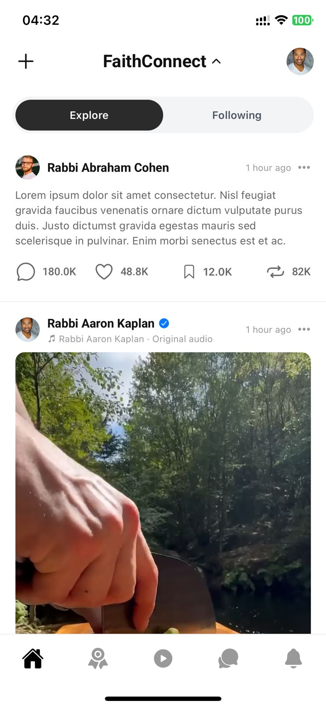

# FaithConnect



## Overview

FaithConnect is a mobile-first social platform designed to connect worshipers with faith leaders across multiple religious communities. Built with React Native and Expo, the app provides a seamless experience for sharing spiritual guidance, engaging with religious content, and fostering meaningful connections within faith communities.

## Features

- **Home Feed**: Scroll through posts, videos, and reels from faith leaders
- **Sticky Animated Header**: Smooth header animations with expandable Explore/Following toggle
- **Video Support**: Native video playback for reels (9:16) and posts (16:9)
- **Leaders**: Discover and follow faith leaders from various religious backgrounds
- **Messages**: Direct messaging with leaders and community members
- **Notifications**: Stay updated with engagement and community activities
- **Reels**: Short-form vertical video content from faith leaders

## Tech Stack

- **Framework**: Expo SDK 54 + React Native 0.81.5
- **Routing**: Expo Router (file-based routing)
- **Styling**: NativeWind 4.1.23 (Tailwind CSS for React Native)
- **State Management**: Zustand 5.0.6
- **Video**: expo-av for native video playback
- **Fonts**: Roboto (custom font family)
- **UI Design**: iOS-style light theme

## Design Philosophy

FaithConnect features a clean, iOS-inspired design with:
- White backgrounds and dark text for readability
- No shadows for a flat, modern aesthetic
- Smooth animations and transitions
- Consistent typography using Roboto font
- Intuitive navigation with icon-only bottom tabs

## Installation

```bash
# Install dependencies
npm install

# Start development server
npm start

# Run on iOS
npm run ios

# Run on Android
npm run android
```

## Project Structure

```
app/
  (tabs)/         # Bottom tab navigation screens
  auth/          # Authentication screens
  leaders/       # Leader profile screens
  messages/      # Chat screens
components/
  Buttons/       # Reusable button components
  Feed/          # PostCard, ReelCard components
  Headers/       # HomeHeader, TopBar components
  InputFields/   # Form input components
stores/          # Zustand state management
assets/
  design/        # Design mockups and references
  images/        # App icons and splash screens
```

## License

Proprietary - All rights reserved. See [LICENSE](./LICENSE) for details.

## Author

**Sujan Bhatta**

---

© 2026 FaithConnect. All rights reserved.
